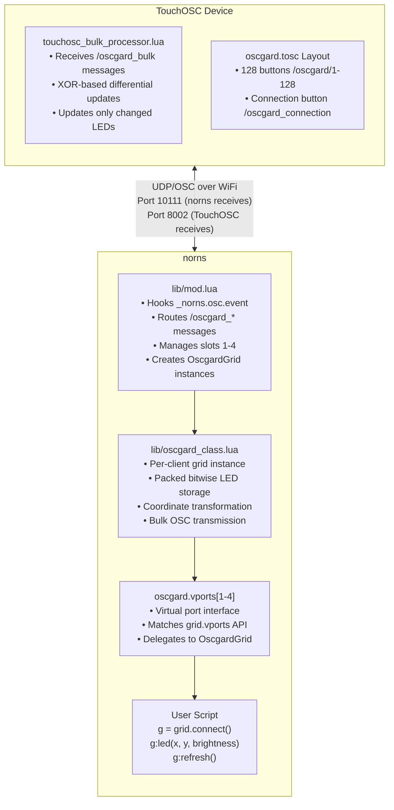
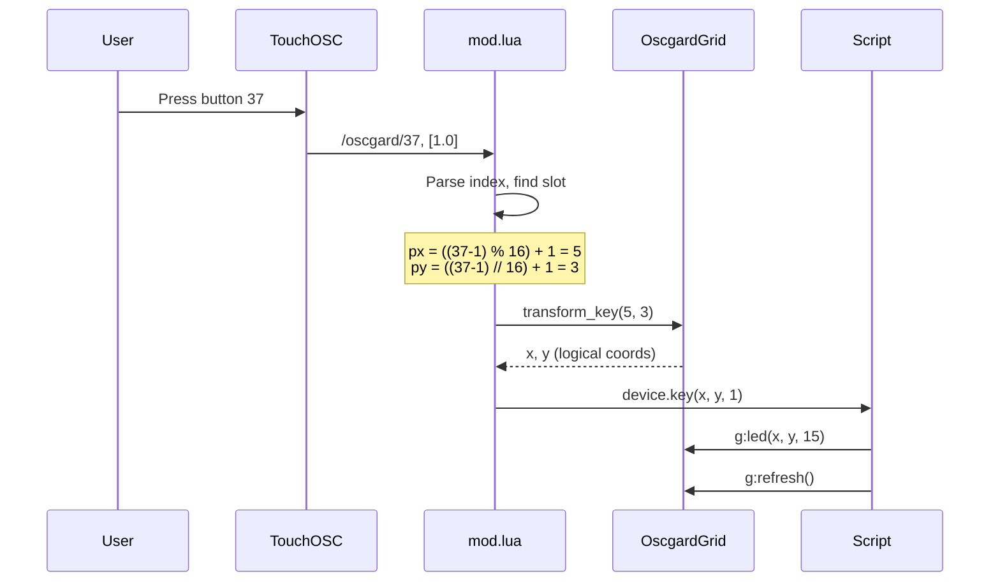
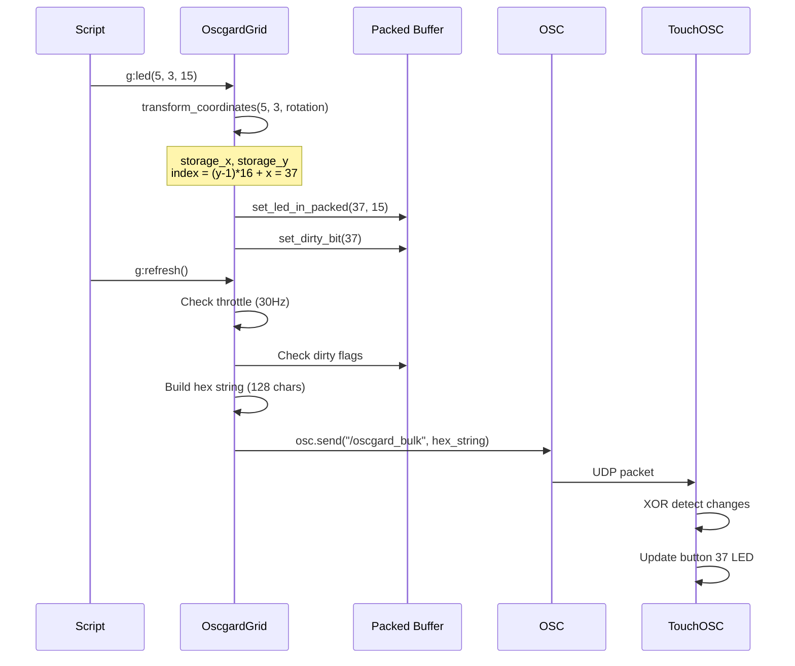
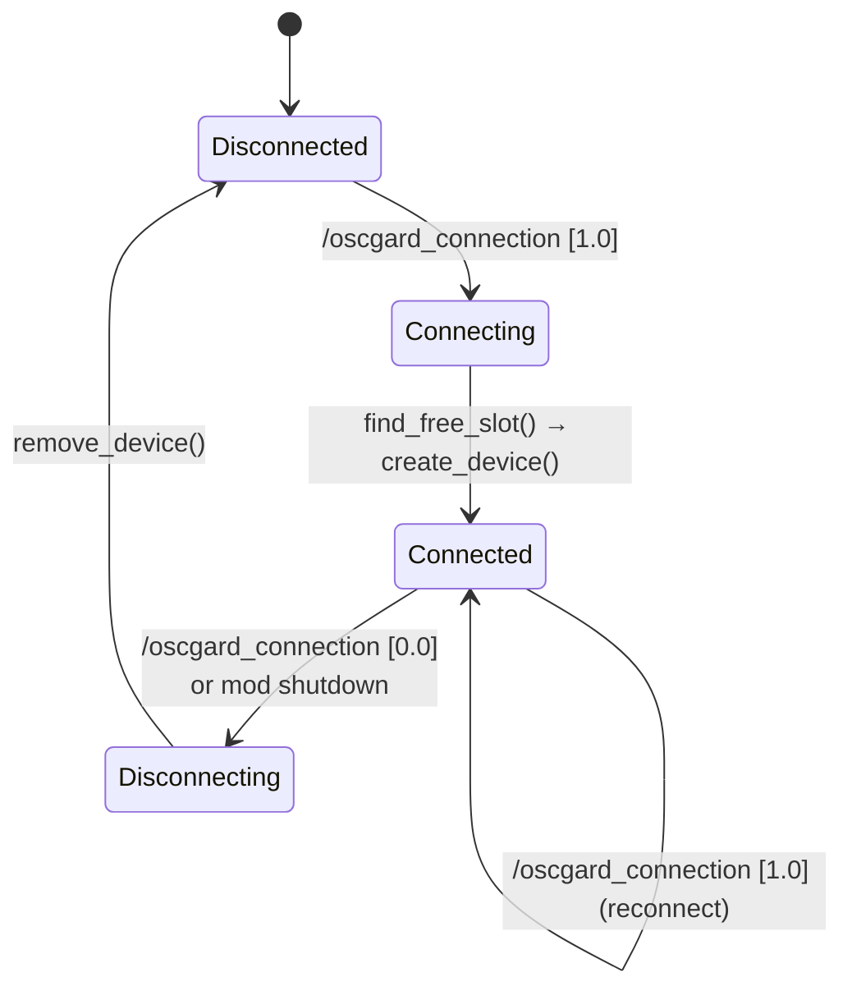

# Oscgard Architecture

This document provides a detailed technical breakdown of how oscgard works, suitable for developers and AI agents working on the codebase.

---

## System Overview

Oscgard creates virtual monome grid devices that norns scripts can use exactly like physical hardware. The system bridges TouchOSC (running on iOS/Android) with norns over WiFi using OSC messages.



---

## Component Details

### 1. Mod Entry Point (`lib/mod.lua`)

The mod is the central coordinator that runs at system level.

#### Initialization

```lua
mod.hook.register("system_post_startup", "oscgard init", function()
    -- Hook _norns.osc.event (internal handler, can't be overwritten by scripts)
    original_norns_osc_event = _norns.osc.event
    _norns.osc.event = oscgard_osc_handler
end)
```

Key point: We hook `_norns.osc.event` not `osc.event` because:
- `_norns.osc.event` is the internal C-level callback
- Scripts can overwrite `osc.event` but not `_norns.osc.event`
- This ensures oscgard always receives messages first

#### OSC Routing

```lua
local function oscgard_osc_handler(path, args, from)
    if path:sub(1,16) == "/oscgard_connection" then
        -- Handle connection request
        local slot = find_free_slot()
        create_device(slot, {from[1], from[2]})
    elseif path:sub(1,10) == "/oscgard/" then
        -- Handle button press
        local i = tonumber(path:sub(11))
        local slot = find_client_slot(from[1])
        local device = oscgard.slots[slot]
        -- Transform coords and call key handler
        device.key(x, y, z)
        return  -- Consumed, don't pass to original
    end
    -- Pass unhandled messages to original handler
    original_norns_osc_event(path, args, from)
end
```

#### Slot Management

```lua
-- Up to 4 slots matching norns grid port limit
local MAX_SLOTS = 4
oscgard.slots = {}  -- slot -> OscgardGrid instance

-- Find existing client by IP
local function find_client_slot(ip)
    for slot, device in pairs(oscgard.slots) do
        if device.client[1] == ip then return slot end
    end
    return nil
end

-- Find first available slot
local function find_free_slot()
    for i = 1, MAX_SLOTS do
        if not oscgard.slots[i] then return i end
    end
    return nil
end
```

#### Virtual Ports

```lua
-- Initialize vports (like norns grid.vports)
oscgard.vports = {}
for i = 1, MAX_SLOTS do
    oscgard.vports[i] = {
        name = "none",
        device = nil,
        key = nil,  -- Script sets this
        
        -- Delegate methods to actual device
        led = function(self, x, y, val)
            if self.device then self.device:led(x, y, val) end
        end,
        refresh = function(self)
            if self.device then self.device:refresh() end
        end,
        -- ... etc
    }
end
```

---

### 2. Grid Class (`lib/oscgard_class.lua`)

Each connected TouchOSC client gets its own OscgardGrid instance.

#### Packed Bitwise Storage

```lua
-- Configuration
local LEDS_PER_WORD = 8  -- 8 LEDs per 32-bit word
local BITS_PER_LED = 4   -- 4 bits = 16 brightness levels

-- Create packed buffer (16 words for 128 LEDs)
local function create_packed_buffer(width, height)
    local total_leds = width * height  -- 128
    local num_words = math.ceil(total_leds / LEDS_PER_WORD)  -- 16
    local buffer = {}
    for i = 1, num_words do
        buffer[i] = 0  -- Each word starts as 0x00000000
    end
    return buffer
end
```

#### LED Operations

```lua
-- Get LED brightness from packed buffer
local function get_led_from_packed(buffer, index)
    local word_index = math.floor((index - 1) / LEDS_PER_WORD) + 1
    local led_offset = (index - 1) % LEDS_PER_WORD
    local bit_shift = led_offset * BITS_PER_LED
    local mask = (1 << BITS_PER_LED) - 1  -- 0x0F
    
    return (buffer[word_index] >> bit_shift) & mask
end

-- Set LED brightness in packed buffer
local function set_led_in_packed(buffer, index, brightness)
    local word_index = math.floor((index - 1) / LEDS_PER_WORD) + 1
    local led_offset = (index - 1) % LEDS_PER_WORD
    local bit_shift = led_offset * BITS_PER_LED
    local mask = (1 << BITS_PER_LED) - 1
    
    -- Clear old value and set new
    local clear_mask = ~(mask << bit_shift)
    buffer[word_index] = (buffer[word_index] & clear_mask) | 
                         ((brightness & mask) << bit_shift)
end
```

#### Rotation Transformation

```lua
-- Transform logical coords to physical storage coords
local function transform_coordinates(x, y, rotation, cols, rows)
    if rotation == 0 then
        return x, y
    elseif rotation == 1 then  -- 90° CW
        return y, rows + 1 - x
    elseif rotation == 2 then  -- 180°
        return cols + 1 - x, rows + 1 - y
    elseif rotation == 3 then  -- 270° CW
        return cols + 1 - y, x
    end
    return x, y
end
```

#### Refresh and Bulk Transmission

```lua
function OscgardGrid:refresh()
    -- Throttle to 30Hz
    local now = util.time()
    if (now - self.last_refresh_time) < self.refresh_interval then
        return
    end
    self.last_refresh_time = now
    
    -- Only send if something changed
    if has_dirty_bits(self.dirty) then
        self:send_bulk_grid_state()
        -- Copy new state to old
        for i = 1, #self.new_buffer do
            self.old_buffer[i] = self.new_buffer[i]
        end
        clear_all_dirty_bits(self.dirty)
    end
end

function OscgardGrid:send_bulk_grid_state()
    local total_leds = self.cols * self.rows
    local hex_chars = {}
    
    -- Extract each LED and convert to hex
    for i = 1, total_leds do
        local brightness = get_led_from_packed(self.new_buffer, i)
        hex_chars[i] = string.format("%X", brightness)
    end
    
    -- Send as single message
    local hex_string = table.concat(hex_chars)
    osc.send(self.client, "/oscgard_bulk", {hex_string})
end
```

---

### 3. TouchOSC Client (`touchosc_bulk_processor.lua`)

The TouchOSC Lua script receives bulk updates and efficiently updates the UI.

#### Lua 5.1 Bitwise Operations

TouchOSC uses Lua 5.1 which lacks native bitwise operators:

```lua
-- Mathematical implementation of bitwise AND
local function bit_and(a, b)
    local result, power = 0, 1
    while a > 0 and b > 0 do
        if a % 2 == 1 and b % 2 == 1 then
            result = result + power
        end
        a = math.floor(a / 2)
        b = math.floor(b / 2)
        power = power * 2
    end
    return result
end

-- Similar implementations for OR, XOR, shifts...
```

#### XOR-Based Differential Updates

```lua
-- Convert hex string to packed words
local function hex_to_packed_words(hex_string)
    local words = {}
    for word_idx = 1, WORDS_NEEDED do
        local word_value = 0
        local start_led = (word_idx - 1) * LEDS_PER_WORD + 1
        
        for led_in_word = 0, LEDS_PER_WORD - 1 do
            local led_idx = start_led + led_in_word
            local hex_char = hex_string:sub(led_idx, led_idx)
            local brightness = tonumber(hex_char, 16) or 0
            word_value = bit_or(word_value, 
                                bit_lshift(brightness, led_in_word * BITS_PER_LED))
        end
        words[word_idx] = word_value
    end
    return words
end

-- Compare and update only changed LEDs
local function handle_bulk_update_differential(hex_string)
    local new_words = hex_to_packed_words(hex_string)
    
    for word_idx = 1, WORDS_NEEDED do
        local old_word = last_grid_words[word_idx] or 0
        local new_word = new_words[word_idx]
        
        -- XOR reveals changed bits
        local diff_word = bit_xor(old_word, new_word)
        
        if diff_word ~= 0 then
            -- Only check LEDs in this changed word
            for led_in_word = 0, LEDS_PER_WORD - 1 do
                local led_mask = bit_lshift(0xF, led_in_word * BITS_PER_LED)
                
                if bit_and(diff_word, led_mask) ~= 0 then
                    -- This LED changed
                    local led_idx = (word_idx - 1) * LEDS_PER_WORD + led_in_word + 1
                    local brightness = extract_led_from_word(new_word, led_in_word)
                    update_led_visual(led_idx, brightness)
                end
            end
        end
        
        last_grid_words[word_idx] = new_word
    end
end
```

---

## Data Flow

### Button Press Flow



### LED Update Flow



---

## Memory Layout

### Packed Buffer Structure

```
buffer[1]  = 0x????????  LEDs   1-8   (row 1, cols 1-8)
buffer[2]  = 0x????????  LEDs   9-16  (row 1, cols 9-16)
buffer[3]  = 0x????????  LEDs  17-24  (row 2, cols 1-8)
buffer[4]  = 0x????????  LEDs  25-32  (row 2, cols 9-16)
...
buffer[15] = 0x????????  LEDs 113-120 (row 8, cols 1-8)
buffer[16] = 0x????????  LEDs 121-128 (row 8, cols 9-16)

Each 32-bit word:
┌────────┬────────┬────────┬────────┬────────┬────────┬────────┬────────┐
│ LED7   │ LED6   │ LED5   │ LED4   │ LED3   │ LED2   │ LED1   │ LED0   │
│ 4 bits │ 4 bits │ 4 bits │ 4 bits │ 4 bits │ 4 bits │ 4 bits │ 4 bits │
└────────┴────────┴────────┴────────┴────────┴────────┴────────┴────────┘
 bits     bits     bits     bits     bits     bits     bits     bits
 28-31    24-27    20-23    16-19    12-15    8-11     4-7      0-3
```

### Dirty Flags Structure

```
dirty[1] = 0x????????  Flags for LEDs   1-32
dirty[2] = 0x????????  Flags for LEDs  33-64
dirty[3] = 0x????????  Flags for LEDs  65-96
dirty[4] = 0x????????  Flags for LEDs  97-128

Each bit = 1 LED's dirty state
Total: 4 words × 32 bits = 128 bits
```

---

## State Machine

### Client Connection States



---

## Performance Optimizations

### 1. Throttled Refresh

```lua
-- Only refresh at 30Hz maximum
if (now - self.last_refresh_time) < 0.01667 then
    return  -- Skip this refresh call
end
```

### 2. Dirty Bit Checking

```lua
-- Quick check if any updates needed
local function has_dirty_bits(dirty_array)
    for i = 1, #dirty_array do
        if dirty_array[i] ~= 0 then return true end
    end
    return false
end

-- Skip transmission if nothing changed
if not has_dirty_bits(self.dirty) then
    return
end
```

### 3. Efficient Serialization

```lua
-- Use table.concat instead of string concatenation
local hex_chars = {}
for i = 1, 128 do
    hex_chars[i] = string.format("%X", brightness)
end
local hex_string = table.concat(hex_chars)  -- Fast!
```

### 4. XOR Change Detection

```lua
-- Compare entire words at once
local diff = bit_xor(old_word, new_word)
if diff == 0 then
    -- 8 LEDs unchanged, skip entirely
end
```

---

## Error Handling

### Bounds Checking

```lua
-- In OscgardGrid:led()
if x < 1 or x > logical_cols or y < 1 or y > logical_rows then
    return  -- Silent ignore out-of-bounds
end

-- After coordinate transformation
if storage_x < 1 or storage_x > self.cols or 
   storage_y < 1 or storage_y > self.rows then
    return  -- Safety check
end
```

### Null Safety

```lua
-- Check buffer word exists
if not buffer[word_index] then
    return 0  -- Default brightness
end

-- Check device has key handler
if device and device.key then
    device.key(x, y, z)
end
```

### Handler Chaining

```lua
-- Always pass unhandled messages to original
if not consumed then
    if original_norns_osc_event then
        original_norns_osc_event(path, args, from)
    end
end
```

---

## Testing Considerations

### Unit Test Cases

1. **Coordinate transformation**: All 4 rotations, edge cases
2. **Packed buffer operations**: Get/set at all indices
3. **Dirty flag operations**: Set, check, clear
4. **Index calculations**: 2D to 1D, edge cases

### Integration Test Cases

1. **Connection flow**: Connect, reconnect, disconnect
2. **Multi-client**: Multiple clients, slot allocation
3. **Message flow**: Button → LED → refresh → OSC
4. **Rotation**: LED and key transformations match

### Performance Test Cases

1. **Refresh rate**: Verify 30Hz throttling
2. **Bulk efficiency**: Message size, frequency
3. **Memory usage**: No leaks over time
4. **CPU usage**: Animation scenarios
