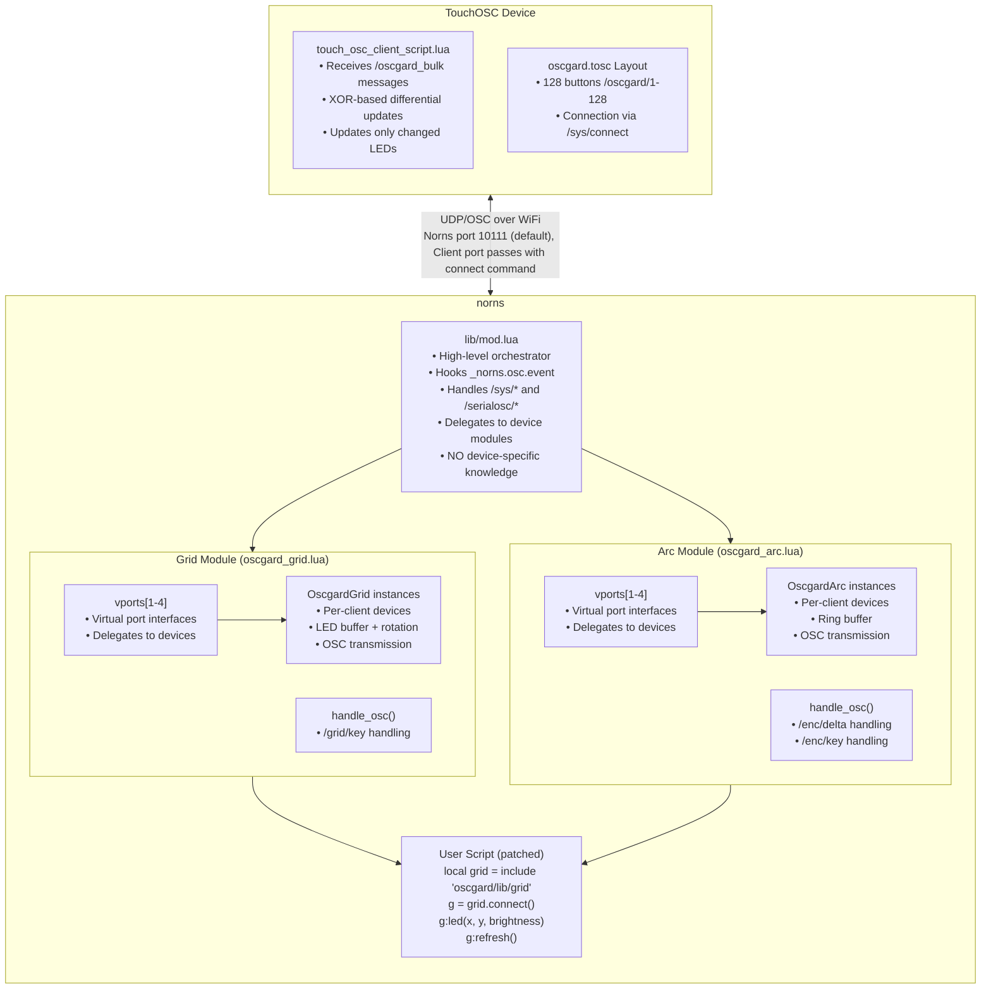
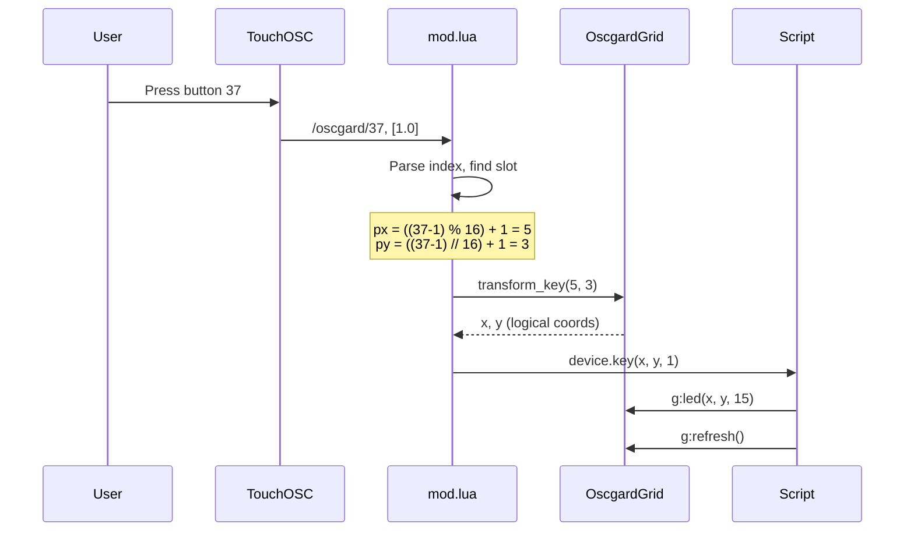
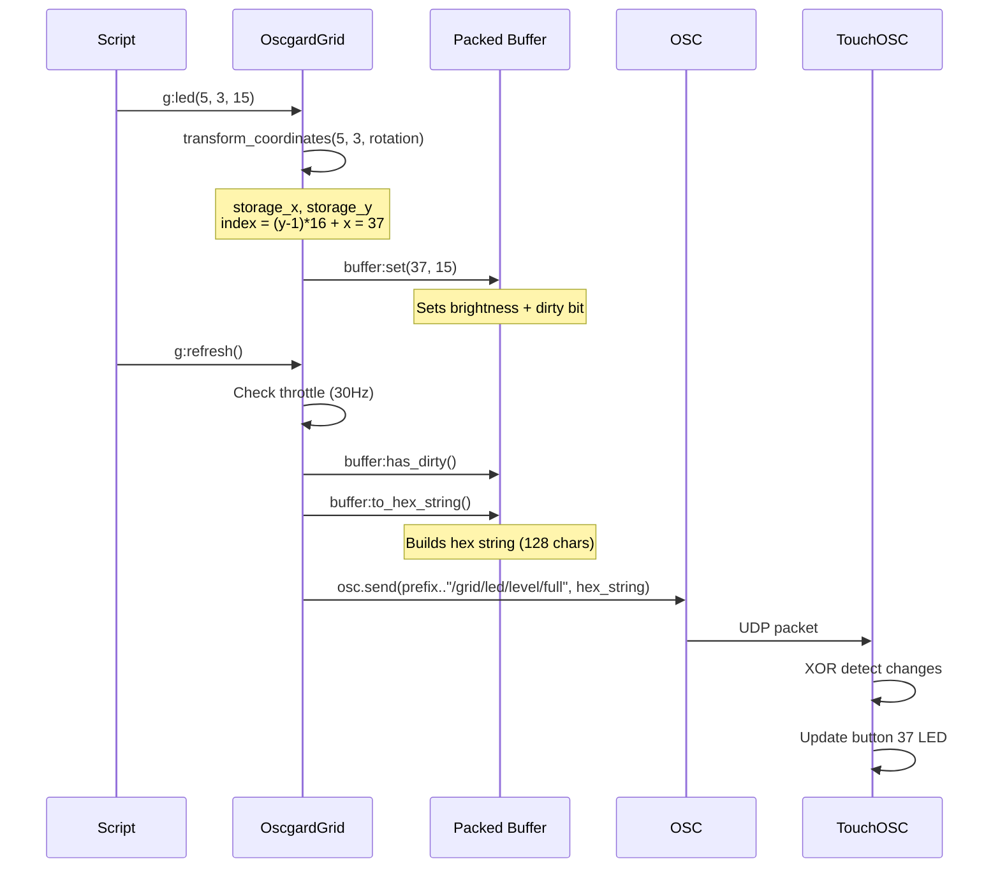
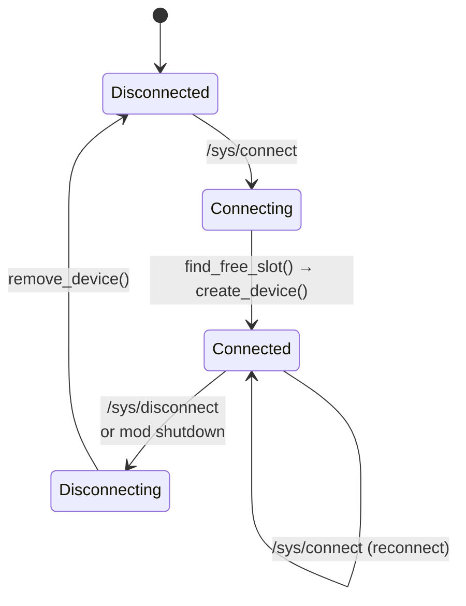

# Oscgard Architecture

This document provides a detailed technical breakdown of how oscgard works, suitable for developers and AI agents working on the codebase.

> **Last Updated**: December 2025 - Refactored to use virtual device module abstraction

---

## System Overview

Oscgard is an mod that intercepts monome grid/arc API calls and routes them to any OSC client app implementing the oscgard and monome device specifications. Currently, a TouchOSC implementation with grid support is provided.

> **Note**: Scripts currently need to be patched to use oscgard. This may change in future versions.

### Architecture Principles

**Virtual Device Abstraction**: As of December 2025, oscgard uses a modular architecture where:
- **mod.lua** acts as a high-level orchestrator working with virtual devices
- **oscgard_grid.lua** and **oscgard_arc.lua** are self-contained modules managing their own devices
- Each module handles device-specific OSC protocol and lifecycle
- mod.lua has no direct knowledge of device implementation details



---

## Component Details

### 1. Mod Entry Point (`lib/mod.lua`)

The mod is the high-level orchestrator working with virtual device abstraction. It delegates device-specific operations to modules.

#### Module Architecture (December 2025 Refactoring)

```lua
-- Virtual device modules
local grid_module = include 'oscgard/lib/oscgard_grid'
local arc_module = include 'oscgard/lib/oscgard_arc'

local oscgard = {
    initialized = false,
    prefix = "/oscgard",
    notify_clients = {},

    -- Device modules (self-contained)
    grid = grid_module,  -- Manages own vports, callbacks, devices
    arc = arc_module     -- Manages own vports, callbacks, devices
}

-- Helper to get module by device type
local function get_module(device_type)
    return device_type == "arc" and arc_module or grid_module
end
```

**Key Changes**:
- mod.lua no longer creates or manages vports directly
- No direct references to OscgardGrid/OscgardArc classes
- Delegates device creation/destruction to modules
- Delegates device-specific OSC handling to modules
- Maintains only high-level orchestration

#### Initialization

```lua
mod.hook.register("system_post_startup", "oscgard init", function()
    -- Hook _norns.osc.event (internal handler, can't be overwritten by scripts)
    original_norns_osc_event = _norns.osc.event
    _norns.osc.event = oscgard_osc_handler
end)
```

Key point: We hook `_norns.osc.event` not `osc.event` because:
- `_norns.osc.event` is the internal C-level callback
- Scripts can overwrite `osc.event` but not `_norns.osc.event`
- This ensures oscgard always receives messages first

#### OSC Routing (Refactored)

```lua
local function oscgard_osc_handler(path, args, from)
    -- Handle serialosc discovery (/serialosc/*, /sys/*)
    if handle_serialosc_discovery(path, args, from) then
        return
    end

    local slot, device_type, device = find_client_any(from[1], from[2])
    local prefix = (device and device.prefix) or oscgard.prefix

    -- Handle /sys/connect, /sys/disconnect, etc.
    if path == "/sys/connect" then
        local device_module = get_module(device_type or "grid")
        local device = device_module.create_vport(slot, client, cols, rows, serial)
        notify_device_added(device)
        return
    end

    -- Delegate device-specific messages to modules
    if device and grid_module.handle_osc(path, args, device, prefix) then
        return  -- Grid module handled it
    end

    if device and arc_module.handle_osc(path, args, device, prefix) then
        return  -- Arc module handled it
    end

    -- Pass unhandled messages to original handler
    if original_norns_osc_event then
        original_norns_osc_event(path, args, from)
    end
end
```

**Key Benefits**:
- Clean separation: mod.lua handles system messages, modules handle device messages
- Extensible: new device types can be added as modules
- Maintainable: device logic is isolated

#### Slot Management (Refactored)

```lua
-- Up to 4 slots per device type (matching norns grid/arc port limits)
local MAX_SLOTS = 4

-- Get module reference by device type
local function get_module(device_type)
    return device_type == "arc" and arc_module or grid_module
end

-- Find existing client by IP, port, and device type
local function find_client_slot(ip, port, device_type)
    local vports = get_module(device_type).vports  -- Module owns vports
    for i = 1, MAX_SLOTS do
        local device = vports[i].device
        if device and device.client[1] == ip and device.client[2] == port then
            return i
        end
    end
    return nil
end

-- Search for client across all device types
local function find_any_client(ip, port)
    for _, device_type in ipairs({ "grid", "arc" }) do
        local slot = find_client_slot(ip, port, device_type)
        if slot then
            local device_module = get_module(device_type)
            return slot, device_type, device_module.vports[slot].device
        end
    end
    return nil, nil, nil
end

-- Find first available slot for a device type
local function find_free_slot(device_type)
    local vports = get_module(device_type).vports  -- Module owns vports
    for i = 1, MAX_SLOTS do
        if not vports[i].device then return i end
    end
    return nil
end
```

**Key Changes**:
- Slot management remains in mod.lua (it's generic)
- But now accesses vports through module references
- No hardcoded oscgard.grid.vports or oscgard.arc.vports

#### Device Lifecycle (Delegated to Modules)

```lua
-- Device creation - delegated to module
local function create_device(slot, client, device_type, cols, rows, serial)
    device_type = device_type or "grid"
    local device_module = get_module(device_type)

    -- Module creates vport and attaches device
    local device = device_module.create_vport(slot, client, cols, rows, serial)

    -- mod.lua handles serialosc notifications
    notify_device_added(device)

    return device
end

-- Device removal - delegated to module
local function remove_device(slot, device_type)
    device_type = device_type or "grid"
    local device_module = get_module(device_type)
    local vport = device_module.vports[slot]
    local device = vport.device
    if not device then return end

    -- mod.lua handles serialosc notifications
    notify_device_removed(device)

    -- Module handles cleanup and vport clearing
    device_module.destroy_vport(slot)
end
```

**Responsibilities**:
- **mod.lua**: Orchestrates, handles notifications
- **Modules**: Create/destroy vports, manage devices, call callbacks

---

### 2. Device Modules (`lib/oscgard_grid.lua`, `lib/oscgard_arc.lua`)

Both grid and arc are now self-contained modules that export a consistent interface.

#### Module Structure

Each module exports:

```lua
return {
    -- State management
    vports = { ... },    -- Array of vports[1-4]
    add = nil,           -- Callback when device connects
    remove = nil,        -- Callback when device disconnects

    -- Lifecycle (called by mod.lua)
    create_vport = function(slot, client, cols, rows, serial) ... end,
    destroy_vport = function(slot) ... end,

    -- OSC handling (called by mod.lua)
    handle_osc = function(path, args, device, prefix) ... end,

    -- Public API (called by scripts)
    connect = function(port) ... end,
    connect_any = function() ... end,
    disconnect = function(slot) ... end,
    get_slots = function() ... end,
    get_device = function(slot) ... end
}
```

#### Grid Module (`oscgard_grid.lua`)

```lua
-- Module creates and manages vports
local vports = {}
for i = 1, 4 do
    vports[i] = {
        name = "none",
        device = nil,
        key = nil,  -- Script callback

        -- Delegate to device
        led = function(self, x, y, val)
            if self.device then self.device:led(x, y, val) end
        end,
        refresh = function(self)
            if self.device then self.device:refresh() end
        end,
        -- ... etc
    }
end

-- Module handles grid-specific OSC
function module.handle_osc(path, args, device, prefix)
    if path == prefix .. "/grid/key" then
        local x = math.floor(args[1] + 1)  -- 0-indexed to 1-indexed
        local y = math.floor(args[2] + 1)
        local z = math.floor(args[3])
        local lx, ly = device:transform_key(x, y)
        device.key(lx, ly, z)
        return true  -- Handled
    end
    return false  -- Not handled
end
```

#### Arc Module (`oscgard_arc.lua`)

```lua
-- Module handles arc-specific OSC
function module.handle_osc(path, args, device, prefix)
    -- /enc/delta - encoder rotation
    if path == prefix .. "/enc/delta" then
        local n = math.floor(args[1]) + 1  -- 0-indexed to 1-indexed
        local d = math.floor(args[2])      -- Signed delta
        device.delta(n, d)
        return true
    end

    -- /enc/key - encoder button press
    if path == prefix .. "/enc/key" then
        local n = math.floor(args[1]) + 1
        local z = math.floor(args[2])
        device.key(n, z)
        return true
    end

    return false
end
```

#### Benefits of Module Pattern

1. **Encapsulation**: Each module is self-contained with its own state
2. **Separation of Concerns**: Device-specific logic is isolated from system logic
3. **Extensibility**: New device types can be added by creating new modules
4. **Testability**: Modules can be tested independently
5. **Maintainability**: Changes to one device type don't affect others

---

### 3. Shared Buffer Module (`lib/buffer.lua`)

A reusable packed bitwise storage module used by both grid and arc devices.

#### Features

- **Packed storage**: 4 bits per LED (16 brightness levels), 8 LEDs per 32-bit word
- **Dirty bit tracking**: 1 bit per LED for efficient update detection
- **Memory efficient**: 94% reduction vs 2D arrays
- **Hex serialization**: Direct conversion to OSC message format

#### API

```lua
local Buffer = include 'oscgard/lib/buffer'

-- Create buffer for N LEDs
local buffer = Buffer.new(total_leds)

-- LED operations
buffer:set(index, brightness)  -- Set LED at index (1-based)
brightness = buffer:get(index) -- Get LED brightness
buffer:set_all(brightness)     -- Set all LEDs to same value
buffer:clear()                 -- Reset all to 0

-- Dirty tracking
buffer:set_dirty(index)        -- Mark LED as changed
has_changes = buffer:has_dirty() -- Check if any changes
buffer:clear_dirty()           -- Clear all dirty flags
buffer:mark_all_dirty()        -- Mark all as dirty

-- State management
buffer:commit()                -- Copy new state to old state

-- Serialization
hex_string = buffer:to_hex_string()    -- Convert to "F00A..." format
buffer:from_hex_string(hex_string)     -- Load from hex string

-- Statistics
stats = buffer:stats()  -- Get memory usage info
```

#### Memory Layout

```
Configuration:
- BITS_PER_LED = 4 (16 brightness levels: 0-15)
- LEDS_PER_WORD = 8 (8 LEDs per 32-bit word)

For 128 LEDs (16×8 grid):
- Buffer words: 16 (64 bytes)
- Dirty words: 4 (16 bytes)
- Total: 160 bytes (old + new + dirty)

Each 32-bit word packs 8 LEDs:
┌────────┬────────┬────────┬────────┬────────┬────────┬────────┬────────┐
│ LED7   │ LED6   │ LED5   │ LED4   │ LED3   │ LED2   │ LED1   │ LED0   │
│ 4 bits │ 4 bits │ 4 bits │ 4 bits │ 4 bits │ 4 bits │ 4 bits │ 4 bits │
└────────┴────────┴────────┴────────┴────────┴────────┴────────┴────────┘
```

### 4. Grid Device Class (Internal to `oscgard_grid.lua`)

Each connected TouchOSC client gets its own OscgardGrid instance (internal implementation detail).

#### Buffer Usage

```lua
-- Grid creates a buffer for its LEDs
self.buffer = Buffer.new(cols * rows)

-- LED operations delegate to buffer
function OscgardGrid:led(x, y, z)
    local index = grid_to_index(x, y, self.cols)
    self.buffer:set(index, z)
end

function OscgardGrid:refresh()
    if self.buffer:has_dirty() then
        self:send_level_full()
        self.buffer:commit()
        self.buffer:clear_dirty()
    end
end
```

#### Rotation Transformation

```lua
-- Transform logical coords to physical storage coords
local function transform_coordinates(x, y, rotation, cols, rows)
    if rotation == 0 then
        return x, y
    elseif rotation == 1 then  -- 90° CW
        return y, rows + 1 - x
    elseif rotation == 2 then  -- 180°
        return cols + 1 - x, rows + 1 - y
    elseif rotation == 3 then  -- 270° CW
        return cols + 1 - y, x
    end
    return x, y
end
```

#### Refresh and Bulk Transmission

```lua
function OscgardGrid:refresh()
    -- Throttle to 30Hz
    local now = util.time()
    if (now - self.last_refresh_time) < self.refresh_interval then
        return
    end
    self.last_refresh_time = now

    -- Only send if something changed
    if self.buffer:has_dirty() then
        self:send_level_full()
        self.buffer:commit()
        self.buffer:clear_dirty()
    end
end

function OscgardGrid:send_level_full()
    local prefix = self.prefix or "/monome"
    local hex_string = self.buffer:to_hex_string()
    osc.send(self.client, prefix .. "/grid/led/level/full", { hex_string })
end
```

### 5. Arc Device Class (Internal to `oscgard_arc.lua`)

Each connected Arc client gets its own OscgardArc instance (internal implementation detail).

#### Buffer Usage

```lua
-- Arc creates a buffer for all encoder rings
local total_leds = num_encoders * LEDS_PER_RING  -- e.g., 4 * 64 = 256 LEDs
self.buffer = Buffer.new(total_leds)

-- Convert encoder + LED position to buffer index
local function ring_to_index(encoder, led)
    return (encoder - 1) * LEDS_PER_RING + led
end

-- Ring operations delegate to buffer
function OscgardArc:ring_set(encoder, led, value)
    local index = ring_to_index(encoder, led)
    self.buffer:set(index, value)
    -- Arc sends immediately (no refresh pattern)
    osc.send(self.client, prefix .. "/ring/set", { encoder - 1, led - 1, value })
end
```

---

### 6. TouchOSC Client (`touch_osc_client_script.lua`)

The TouchOSC Lua script receives bulk updates and efficiently updates the UI.

#### Lua 5.1 Bitwise Operations

TouchOSC uses Lua 5.1 which lacks native bitwise operators:

```lua
-- Mathematical implementation of bitwise AND
local function bit_and(a, b)
    local result, power = 0, 1
    while a > 0 and b > 0 do
        if a % 2 == 1 and b % 2 == 1 then
            result = result + power
        end
        a = math.floor(a / 2)
        b = math.floor(b / 2)
        power = power * 2
    end
    return result
end

-- Similar implementations for OR, XOR, shifts...
```

#### XOR-Based Differential Updates

```lua
-- Convert hex string to packed words
local function hex_to_packed_words(hex_string)
    local words = {}
    for word_idx = 1, WORDS_NEEDED do
        local word_value = 0
        local start_led = (word_idx - 1) * LEDS_PER_WORD + 1
        
        for led_in_word = 0, LEDS_PER_WORD - 1 do
            local led_idx = start_led + led_in_word
            local hex_char = hex_string:sub(led_idx, led_idx)
            local brightness = tonumber(hex_char, 16) or 0
            word_value = bit_or(word_value, 
                                bit_lshift(brightness, led_in_word * BITS_PER_LED))
        end
        words[word_idx] = word_value
    end
    return words
end

-- Compare and update only changed LEDs
local function handle_bulk_update_differential(hex_string)
    local new_words = hex_to_packed_words(hex_string)
    
    for word_idx = 1, WORDS_NEEDED do
        local old_word = last_grid_words[word_idx] or 0
        local new_word = new_words[word_idx]
        
        -- XOR reveals changed bits
        local diff_word = bit_xor(old_word, new_word)
        
        if diff_word ~= 0 then
            -- Only check LEDs in this changed word
            for led_in_word = 0, LEDS_PER_WORD - 1 do
                local led_mask = bit_lshift(0xF, led_in_word * BITS_PER_LED)
                
                if bit_and(diff_word, led_mask) ~= 0 then
                    -- This LED changed
                    local led_idx = (word_idx - 1) * LEDS_PER_WORD + led_in_word + 1
                    local brightness = extract_led_from_word(new_word, led_in_word)
                    update_led_visual(led_idx, brightness)
                end
            end
        end
        
        last_grid_words[word_idx] = new_word
    end
end
```

---

## Data Flow

### Button Press Flow



### LED Update Flow



---

## Memory Layout

### Packed Buffer Structure

```
buffer[1]  = 0x????????  LEDs   1-8   (row 1, cols 1-8)
buffer[2]  = 0x????????  LEDs   9-16  (row 1, cols 9-16)
buffer[3]  = 0x????????  LEDs  17-24  (row 2, cols 1-8)
buffer[4]  = 0x????????  LEDs  25-32  (row 2, cols 9-16)
...
buffer[15] = 0x????????  LEDs 113-120 (row 8, cols 1-8)
buffer[16] = 0x????????  LEDs 121-128 (row 8, cols 9-16)

Each 32-bit word:
┌────────┬────────┬────────┬────────┬────────┬────────┬────────┬────────┐
│ LED7   │ LED6   │ LED5   │ LED4   │ LED3   │ LED2   │ LED1   │ LED0   │
│ 4 bits │ 4 bits │ 4 bits │ 4 bits │ 4 bits │ 4 bits │ 4 bits │ 4 bits │
└────────┴────────┴────────┴────────┴────────┴────────┴────────┴────────┘
 bits     bits     bits     bits     bits     bits     bits     bits
 28-31    24-27    20-23    16-19    12-15    8-11     4-7      0-3
```

### Dirty Flags Structure

```
dirty[1] = 0x????????  Flags for LEDs   1-32
dirty[2] = 0x????????  Flags for LEDs  33-64
dirty[3] = 0x????????  Flags for LEDs  65-96
dirty[4] = 0x????????  Flags for LEDs  97-128

Each bit = 1 LED's dirty state
Total: 4 words × 32 bits = 128 bits
```

---

## State Machine

### Client Connection States



---

## Performance Optimizations

### 1. Throttled Refresh

```lua
-- Only refresh at 30Hz maximum
if (now - self.last_refresh_time) < 0.01667 then
    return  -- Skip this refresh call
end
```

### 2. Dirty Bit Checking

```lua
-- Quick check if any updates needed
local function has_dirty_bits(dirty_array)
    for i = 1, #dirty_array do
        if dirty_array[i] ~= 0 then return true end
    end
    return false
end

-- Skip transmission if nothing changed
if not has_dirty_bits(self.dirty) then
    return
end
```

### 3. Efficient Serialization

```lua
-- Use table.concat instead of string concatenation
local hex_chars = {}
for i = 1, 128 do
    hex_chars[i] = string.format("%X", brightness)
end
local hex_string = table.concat(hex_chars)  -- Fast!
```

### 4. XOR Change Detection

```lua
-- Compare entire words at once
local diff = bit_xor(old_word, new_word)
if diff == 0 then
    -- 8 LEDs unchanged, skip entirely
end
```

---

## Error Handling

### Bounds Checking

```lua
-- In OscgardGrid:led()
if x < 1 or x > logical_cols or y < 1 or y > logical_rows then
    return  -- Silent ignore out-of-bounds
end

-- After coordinate transformation
if storage_x < 1 or storage_x > self.cols or 
   storage_y < 1 or storage_y > self.rows then
    return  -- Safety check
end
```

### Null Safety

```lua
-- Check buffer word exists
if not buffer[word_index] then
    return 0  -- Default brightness
end

-- Check device has key handler
if device and device.key then
    device.key(x, y, z)
end
```

### Handler Chaining

```lua
-- Always pass unhandled messages to original
if not consumed then
    if original_norns_osc_event then
        original_norns_osc_event(path, args, from)
    end
end
```

---

## Testing Considerations

### Unit Test Cases

1. **Coordinate transformation**: All 4 rotations, edge cases
2. **Packed buffer operations**: Get/set at all indices
3. **Dirty flag operations**: Set, check, clear
4. **Index calculations**: 2D to 1D, edge cases

### Integration Test Cases

1. **Connection flow**: Connect, reconnect, disconnect
2. **Multi-client**: Multiple clients, slot allocation
3. **Message flow**: Button → LED → refresh → OSC
4. **Rotation**: LED and key transformations match

### Performance Test Cases

1. **Refresh rate**: Verify 30Hz throttling
2. **Bulk efficiency**: Message size, frequency
3. **Memory usage**: No leaks over time
4. **CPU usage**: Animation scenarios

---

## Refactoring History

### December 2025: Virtual Device Module Abstraction

**Motivation**: Improve separation of concerns and make the codebase more maintainable by isolating device-specific logic.

#### Changes Made

**Before**:
- mod.lua directly created vports and managed OscgardGrid/OscgardArc instances
- Device-specific OSC handling was in mod.lua (`/grid/key`, `/enc/delta`, etc.)
- Callbacks (add/remove) were stored in mod.lua's oscgard table
- Tight coupling between orchestration and device implementation

**After**:
- mod.lua works with virtual device abstraction
- oscgard_grid and oscgard_arc are self-contained modules
- Each module exports vports, callbacks, lifecycle methods, and OSC handlers
- mod.lua delegates to modules via consistent interface
- Clean separation: mod.lua = orchestration, modules = devices

#### File Changes

**lib/mod.lua** (~175 lines removed, ~50 lines added):
- Removed vport creation functions
- Removed device-specific OSC handling
- Removed public API implementations
- Added module references and `get_module()` helper
- Simplified to high-level orchestration only

**lib/oscgard_grid.lua** (~155 lines added):
- Added module state section
- Added vport creation and management
- Added `create_vport()` and `destroy_vport()` lifecycle methods
- Added `handle_osc()` for `/grid/key` messages
- Added public API (connect, connect_any, etc.)
- Now exports module table instead of class

**lib/oscgard_arc.lua** (~185 lines added):
- Similar structure to grid module
- Added arc-specific OSC handling (`/enc/delta`, `/enc/key`)
- Added public API matching norns arc API
- Now exports module table instead of class

#### Benefits

1. **Maintainability**: Device changes are isolated to their modules
2. **Extensibility**: New device types can be added as modules without touching mod.lua
3. **Testability**: Modules can be tested independently
4. **Clarity**: Clear responsibility boundaries
5. **No Breaking Changes**: Public API remains the same (`oscgard.grid.*`, `oscgard.arc.*`)

#### API Compatibility

The refactoring maintains full backward compatibility:

```lua
-- Scripts continue to work unchanged
local g = oscgard.grid.connect(1)
g:led(1, 1, 15)
g:refresh()

-- Callbacks still work
oscgard.grid.add = function(device) ... end
oscgard.arc.remove = function(device) ... end
```

The only difference is that `oscgard.grid` and `oscgard.arc` now reference module objects instead of being plain tables, but this is transparent to users.
