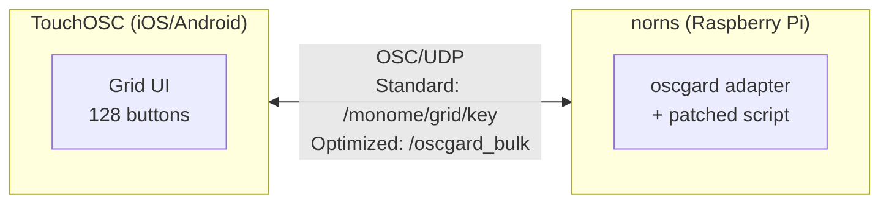
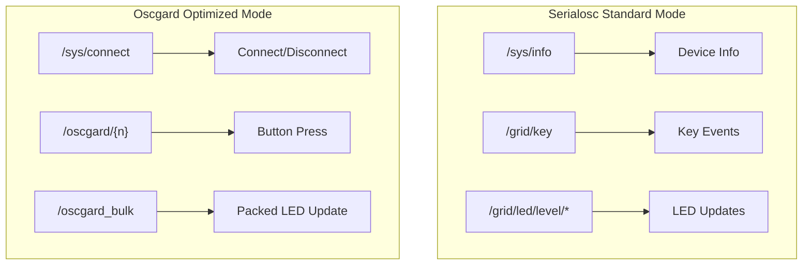

# Oscgard - Specification Document

> **Spec-Driven Development (SDD)** - This document serves as the single source of truth for the oscgard project. AI agents and contributors should reference this specification when implementing features or making changes.

## Project Overview

**Oscgard** is an OSC-to-grid adapter for [norns](https://monome.org/docs/norns/) that intercepts monome grid/arc API calls and routes them to any OSC client app implementing the oscgard and monome device specifications. Currently provides a [TouchOSC](https://hexler.net/touchosc) implementation with grid support.

### What is a Monome Grid?

The [monome grid](https://monome.org/docs/grid/) is an open, tactile instrument consisting of a matrix of backlit buttons. By default, it does nothing - its function is defined by software applications. Key characteristics:

- **Standard sizes**: 64 (8×8), 128 (16×8), or 256 (16×16) buttons
- **LED brightness**: 16 levels (0-15), where 0=off and 15=full bright
- **Button states**: Binary (0=up, 1=down)
- **Communication**: Via serialosc daemon using OSC protocol
- **Rotation**: Supports 0°, 90°, 180°, 270° orientations

### Project Goals

1. **Use a tablet/phone as a monome grid** via TouchOSC or other OSC clients
2. **100% API compatibility** with norns grid API
3. **High performance** over WiFi (low latency, minimal bandwidth)
4. **Extensible** - any OSC client implementing the spec can connect

### Current Limitations

- **Scripts need patching** - add this line at the top of your script:
  ```lua
  local grid = include("oscgard/lib/grid")
  ```
  Or with fallback to hardware grid:
  ```lua
  local grid = util.file_exists(_path.code.."oscgard") and include("oscgard/lib/grid") or grid
  ```
- True transparent mod integration is a future goal

---

## Architecture



### Protocol Modes



### Components

| Component | File | Purpose |
|-----------|------|---------|
| **Grid Module** | `lib/grid.lua` | Drop-in replacement for norns `grid` module |
| **Mod Core** | `lib/mod.lua` | OSC routing, slot management, device lifecycle |
| **Grid Class** | `lib/oscgard_grid.lua` | Per-client grid instance with LED storage |
| **TouchOSC Client** | `touch_osc_client_script.lua` | TouchOSC Lua script for receiving updates |
| **TouchOSC Layout** | `oscgard.tosc` | TouchOSC controller layout file |

---

## Protocol Specification

Oscgard supports **two protocol modes** for maximum compatibility:

1. **Serialosc Standard Protocol** - Compatible with any serialosc-aware client
2. **Oscgard Optimized Protocol** - Low-bandwidth bulk updates for TouchOSC

### Serialosc Standard Protocol

Oscgard implements the [monome serialosc OSC specification](https://monome.org/docs/serialosc/osc/) for seamless compatibility with existing tools.

#### System Messages

| Address | Arguments | Direction | Description |
|---------|-----------|-----------|-------------|
| `/sys/info` | `s` host, `i` port | In | Request device info |
| `/sys/info` | `s` id, `s` type, `i` port | Out | Device identification |
| `/sys/prefix` | `s` prefix | In | Set OSC prefix |
| `/sys/prefix` | `s` prefix | Out | Current prefix |
| `/sys/rotation` | `i` (0,90,180,270) | In | Set rotation |
| `/sys/rotation` | `i` rotation | Out | Current rotation |

#### Key Input (Client → Norns)

| Address | Arguments | Description |
|---------|-----------|-------------|
| `<prefix>/grid/key` | `i` x, `i` y, `i` state | Button press (0-indexed, state 0 or 1) |

#### LED Output (Norns → Client)

| Address | Arguments | Description |
|---------|-----------|-------------|
| `<prefix>/grid/led/level/set` | `i` x, `i` y, `i` level | Set single LED (0-indexed, level 0-15) |
| `<prefix>/grid/led/level/all` | `i` level | Set all LEDs to level |
| `<prefix>/grid/led/level/map` | `i` x_off, `i` y_off, `i[64]` levels | Set 8×8 quad |
| `<prefix>/grid/led/level/row` | `i` x_off, `i` y, `i[8]` levels | Set row of 8 LEDs |
| `<prefix>/grid/led/level/col` | `i` x, `i` y_off, `i[8]` levels | Set column of 8 LEDs |

> **Note**: Default prefix is `/monome`. Coordinates are 0-indexed per serialosc standard.

### Oscgard Optimized Protocol

For low-bandwidth high-performance updates, especially over WiFi:

#### OSC Messages: TouchOSC → Norns

| Address | Arguments | Description |
|---------|-----------|-------------|
| `/sys/connect` | `s` serial | Connection request (default grid 16x8) |
| `/sys/connect` | `s` serial, `s` type | Connection with device type ("grid" or "arc") |
| `/sys/connect` | `s` serial, `s` type, `i` cols, `i` rows | Connection with custom dimensions |
| `/sys/disconnect` | `s` serial | Disconnect request |
| `/oscgard/{n}` | `f` (0.0 or 1.0) | Button press (n=1-128, 1.0=down, 0.0=up) |

#### OSC Messages: Norns → TouchOSC

| Address | Arguments | Description |
|---------|-----------|-------------|
| `/sys/connect` | `s` serial, `s` type, `i` cols, `i` rows | Connection confirmation |
| `/sys/disconnect` | `s` serial | Disconnection notification |
| `/oscgard_bulk` | `s` (hex string) | Bulk LED update (128 hex chars, 0-F each) |
| `/oscgard_compact` | `s` (hex string) | Compact LED update (same as bulk) |
| `/oscgard_rotation` | `i` (0-3) | Grid rotation notification |

### Coordinate Systems

**Serialosc Standard**: Uses 0-indexed coordinates (x: 0-15, y: 0-7)
**Oscgard Optimized**: Uses 1-indexed button indices (1-128)

```
Grid Layout (16×8):

Serialosc (0-indexed x,y):
  (0,0) (1,0) (2,0) ... (15,0)    ← y=0
  (0,1) (1,1) (2,1) ... (15,1)    ← y=1
  ...
  (0,7) (1,7) (2,7) ... (15,7)    ← y=7

Oscgard (1-indexed buttons):
  1   2   3   4   5   6   7   8   9  10  11  12  13  14  15  16    ← Row 1
 17  18  19  20  21  22  23  24  25  26  27  28  29  30  31  32    ← Row 2
 ...
113 114 115 116 117 118 119 120 121 122 123 124 125 126 127 128    ← Row 8
```

**Conversion formulas**:
- Serialosc to button index: `index = y * 16 + x + 1`
- Button index to serialosc: `x = (index - 1) % 16`, `y = (index - 1) // 16`

---

## Data Format Specification

### Packed Bitwise Storage

LED state is stored using packed 32-bit words for memory efficiency:

```
Configuration:
- LEDS_PER_WORD = 8 (8 LEDs per 32-bit word)
- BITS_PER_LED = 4 (16 brightness levels: 0-15)
- Total words = 16 (for 128 LEDs)
- Memory usage = 64 bytes (vs 1024 bytes for 2D array)

Bit Layout per Word:
┌─────┬─────┬─────┬─────┬─────┬─────┬─────┬─────┐
│LED7 │LED6 │LED5 │LED4 │LED3 │LED2 │LED1 │LED0 │
│bits │bits │bits │bits │bits │bits │bits │bits │
│28-31│24-27│20-23│16-19│12-15│ 8-11│ 4-7 │ 0-3 │
└─────┴─────┴─────┴─────┴─────┴─────┴─────┴─────┘

Example: 0x0F8C73B2
  LED7=0xF(15), LED6=0x8(8), LED5=0xC(12), LED4=0x7(7)
  LED3=0x3(3),  LED2=0xB(11), LED1=0x2(2), LED0=0xA(10)
```

### Hex String Format

The `/oscgard_bulk` message contains a 128-character hex string:

```
"0000000000000000F0000000000000000000000000000000..."
 ↑                ↑
 LED1 (row1,col1) LED17 (row2,col1)
 
Each character: '0'-'F' representing brightness 0-15
Total: 128 characters = 128 LEDs
```

---

## API Reference

### Grid API (Monome Compatible)

```lua
-- Connection
g = grid.connect()        -- Connect to first available grid
g = grid.connect(port)    -- Connect to specific port (1-4)

-- LED Control
g:led(x, y, brightness)   -- Set LED at (x,y) to brightness 0-15
g:all(brightness)         -- Set all LEDs to brightness 0-15
g:refresh()               -- Send pending LED updates to device
g:intensity(level)        -- Set global intensity 0-15

-- Rotation
g:rotation(r)             -- Set rotation: 0=0°, 1=90°, 2=180°, 3=270°

-- Properties
g.device.cols             -- Column count (16)
g.device.rows             -- Row count (8)
g.device.id               -- Device ID
g.device.name             -- Device name
g.device.serial           -- Serial number
g.device.port             -- Connected port

-- Callbacks
g.key = function(x, y, z) -- Called on button press (z=1) / release (z=0)
  -- x: column (1-16)
  -- y: row (1-8)
  -- z: state (0 or 1)
end

-- Global Callbacks (static)
grid.add = function(dev)  -- Called when any grid connects
grid.remove = function(dev) -- Called when any grid disconnects
```

### Oscgard-Specific Extensions

```lua
-- Via mod system
local oscgard = require('oscgard/lib/mod')

-- Grid API (matches norns grid.vports structure)
g = oscgard.grid.connect(slot)    -- Connect to specific grid slot (1-4)
g = oscgard.grid.connect_any()    -- Connect to first available oscgard grid
oscgard.grid.disconnect(slot)     -- Disconnect grid from slot
oscgard.grid.get_slots()          -- Get table of connected grids
oscgard.grid.get_device(slot)     -- Get grid at slot

-- Grid Callbacks (set before script init)
oscgard.grid.add = function(dev)    -- Called when oscgard grid connects
oscgard.grid.remove = function(dev) -- Called when oscgard grid disconnects

-- Arc API (matches norns arc.vports structure)
a = oscgard.arc.connect(slot)     -- Connect to specific arc slot (1-4)
a = oscgard.arc.connect_any()     -- Connect to first available oscgard arc
oscgard.arc.disconnect(slot)      -- Disconnect arc from slot
oscgard.arc.get_slots()           -- Get table of connected arcs
oscgard.arc.get_device(slot)      -- Get arc at slot

-- Arc Callbacks (set before script init)
oscgard.arc.add = function(dev)    -- Called when oscgard arc connects
oscgard.arc.remove = function(dev) -- Called when oscgard arc disconnects
```

---

## Coordinate Systems

### Rotation Transformation

Physical storage is always 16×8. Rotation transforms logical coordinates:

```lua
-- Rotation 0 (0°):   No change
-- Rotation 1 (90°):  (x,y) → (y, 9-x)
-- Rotation 2 (180°): (x,y) → (17-x, 9-y)
-- Rotation 3 (270°): (x,y) → (17-y, x)

-- Logical grid dimensions:
-- Rotation 0, 2: 16 cols × 8 rows (same as physical)
-- Rotation 1, 3: 8 cols × 16 rows (swapped)
```

### Key Input Transformation

Button presses from TouchOSC are physical coordinates. They must be transformed to logical coordinates before passing to script's key handler:

```lua
-- Physical coords from TouchOSC (always 16x8)
local px = ((button_index - 1) % 16) + 1
local py = math.floor((button_index - 1) / 16) + 1

-- Transform to logical coords based on rotation
local x, y = device:transform_key(px, py)
```

---

## Performance Specifications

### Refresh Rate

| Metric | Value |
|--------|-------|
| Target refresh rate | 30 Hz |
| Refresh interval | 33.3 ms |
| Throttle mechanism | Time-based with `last_refresh_time` |

### Network Efficiency

| Metric | Original (Individual) | Optimized (Bulk) | Improvement |
|--------|----------------------|------------------|-------------|
| Messages per refresh | 128 | 1 | **128× fewer** |
| Bytes per refresh | ~2,560 | ~140 | **94% reduction** |
| Update atomicity | Sequential | Atomic | No tearing |

### Memory Efficiency

| Storage | Original (2D Array) | Optimized (Packed) | Improvement |
|---------|--------------------|--------------------|-------------|
| Buffer size | 1024 bytes | 64 bytes | **94% reduction** |
| Cache lines | 16 | 1 | **16× better** |
| Dirty flags | 128 booleans | 4 integers (bits) | **32× smaller** |

---

## Dirty Flag System

### Binary Dirty Tracking

Instead of 128 boolean flags, use 4 × 32-bit integers:

```lua
-- Structure: 4 integers holding 128 bits total
dirty = {0x00000000, 0x00000000, 0x00000000, 0x00000000}

-- Set dirty bit for LED at index i (1-128)
local word_index = math.floor((i - 1) / 32) + 1
local bit_index = (i - 1) % 32
dirty[word_index] = dirty[word_index] | (1 << bit_index)

-- Check if any LED is dirty
local has_changes = dirty[1] ~= 0 or dirty[2] ~= 0 or dirty[3] ~= 0 or dirty[4] ~= 0

-- Clear all dirty flags
for i = 1, 4 do dirty[i] = 0 end
```

---

## TouchOSC Client Specification

### Differential Update Algorithm

The TouchOSC client implements XOR-based change detection:

```lua
-- Compare packed words instead of individual characters
for word_idx = 1, WORDS_NEEDED do
  local diff_word = bit_xor(old_word, new_word)
  if diff_word ~= 0 then
    -- Only process changed LEDs in this word
    for led_in_word = 0, LEDS_PER_WORD - 1 do
      local led_mask = bit_lshift(0xF, led_in_word * BITS_PER_LED)
      if bit_and(diff_word, led_mask) ~= 0 then
        -- This LED changed - update visual
        update_led(button_address, new_brightness)
      end
    end
  end
end
```

### Lua 5.1 Compatibility

TouchOSC uses Lua 5.1 which lacks native bitwise operators. Use mathematical equivalents:

```lua
-- Bitwise OR
function bit_or(a, b)
  local result, power = 0, 1
  while a > 0 or b > 0 do
    if a % 2 == 1 or b % 2 == 1 then result = result + power end
    a, b = math.floor(a/2), math.floor(b/2)
    power = power * 2
  end
  return result
end

-- Bitwise AND, XOR, LSHIFT, RSHIFT follow same pattern
```

---

## Mod System Integration

### Lifecycle Hooks

```lua
-- Called after norns system startup
mod.hook.register("system_post_startup", "oscgard init", function()
  -- Hook _norns.osc.event (not osc.event) for priority handling
  original_norns_osc_event = _norns.osc.event
  _norns.osc.event = oscgard_osc_handler
end)

-- Called before norns shutdown
mod.hook.register("system_pre_shutdown", "oscgard cleanup", function()
  -- Disconnect all clients, restore handlers
end)

-- Called after script cleanup
mod.hook.register("script_post_cleanup", "oscgard script cleanup", function()
  -- Clear all LEDs on script stop
end)
```

### Slot Management

- Maximum 4 slots (matching norns grid port limit)
- Clients identified by IP address
- Reconnecting client reuses existing slot
- New clients get first available slot

---

## Error Handling

### Bounds Checking

```lua
-- LED coordinates (with rotation consideration)
if x < 1 or x > logical_cols or y < 1 or y > logical_rows then
  return -- Silent ignore
end

-- Brightness clamping
brightness = math.max(0, math.min(15, z))

-- Rotation validation
if val < 0 or val > 3 then
  print("Error: Invalid rotation value " .. val)
  return
end
```

### Connection Handling

- No free slots: Send `/sys/connect` with `0` (refused)
- Client reconnect: Refresh existing connection instead of creating new
- Null safety: Check `device.key` before calling

---

## File Structure

```
oscgard/
├── lib/
│   ├── grid.lua             # Drop-in grid module replacement (main entrypoint)
│   ├── mod.lua              # Norns mod, OSC routing, slot management
│   └── oscgard_grid.lua     # Per-client grid instance class
├── examples/
│   ├── flat_array_benchmark.lua # Performance benchmarks
│   ├── oscgard_perf_test.lua    # Automated tests
│   ├── performance_test.lua     # Performance tests
│   └── rotation_demo.lua        # Rotation demonstration
├── docs/
│   ├── SPEC.md              # This specification
│   ├── ARCHITECTURE.md      # System architecture details
│   ├── CHANGELOG.md         # Version history
│   ├── IMPROVEMENTS.md      # Improvement notes
│   └── archive/             # Archived documentation
├── oscgard.tosc             # TouchOSC layout
├── touch_osc_client_script.lua  # TouchOSC client script
├── README.md                # User documentation
└── LICENSE                  # GPL-3.0
```

---

## Version History

See [CHANGELOG.md](./CHANGELOG.md) for detailed version history.

### Current Version Features

- ✅ Mod support (system-wide, no script modifications)
- ✅ Packed bitwise storage (64 bytes for 128 LEDs)
- ✅ Bulk OSC updates (single message per refresh)
- ✅ Full rotation support (0°, 90°, 180°, 270°)
- ✅ 100% monome grid API compatibility
- ✅ Multiple client support (up to 4 slots)
- ✅ Differential updates on client side
- ✅ 30Hz refresh rate throttling

---

## Contributing

When contributing to this project:

1. **Read this spec first** - Understand the architecture and constraints
2. **Maintain API compatibility** - Don't break existing scripts
3. **Preserve performance** - Don't regress on network/memory efficiency
4. **Test with real hardware** - TouchOSC on actual mobile device
5. **Update documentation** - Keep spec in sync with implementation

---

## References

- [Monome Grid Documentation](https://monome.org/docs/grid/)
- [Norns Grid API Reference](https://monome.org/docs/norns/reference/grid)
- [SerialOSC Protocol](https://monome.org/docs/serialosc/osc/)
- [TouchOSC Documentation](https://hexler.net/touchosc/manual)
