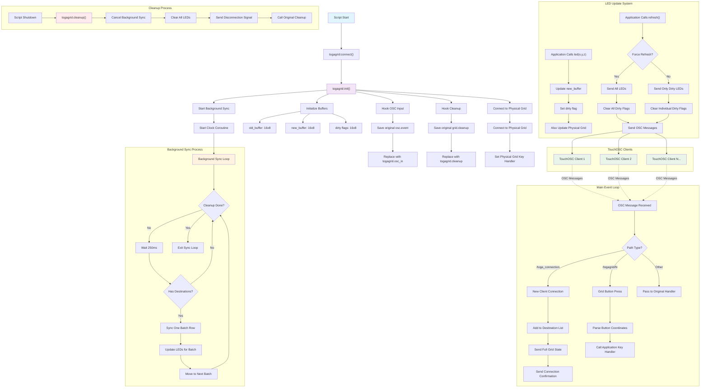

# Togagrid Flow Diagram

This diagram describes the flow and architecture of the `togagrid.lua` script, which creates a virtual grid controller that bridges between a physical grid device and OSC-based TouchOSC clients.

## Key Components

### 1. **Initialization Phase**
- Sets up dual buffer system (old_buffer, new_buffer, dirty flags)
- Hooks into Norns' OSC input system
- Hooks into cleanup system
- Starts background synchronization process
- Connects to physical grid device

### 2. **Dual Buffer System**
- **new_buffer**: Current state that applications write to
- **old_buffer**: Previously sent state for change detection  
- **dirty flags**: Track which LEDs need updates

### 3. **OSC Communication**
- Listens for `/toga_connection` messages from new TouchOSC clients
- Processes `/togagrid/N` button press messages
- Sends LED updates as `/togagrid/N` with brightness values (0.0-1.0)
- Sends connection status via `/toga_connection`

### 4. **Background Sync**
- Runs every 250ms in a separate coroutine
- Syncs one batch of rows per cycle for efficient network usage
- Prevents overwhelming TouchOSC clients with updates

### 5. **Event Flow**
1. TouchOSC client sends button press → OSC handler → Application key callback
2. Application updates LEDs → Buffer updates → Dirty flag marking
3. Application calls refresh → Send dirty/all LEDs → Clear dirty flags
4. Background sync continuously sends batched updates

### 6. **Resource Management**
- Graceful cleanup on script shutdown
- Clears all LEDs before disconnecting
- Cancels background processes
- Restores original OSC/cleanup handlers